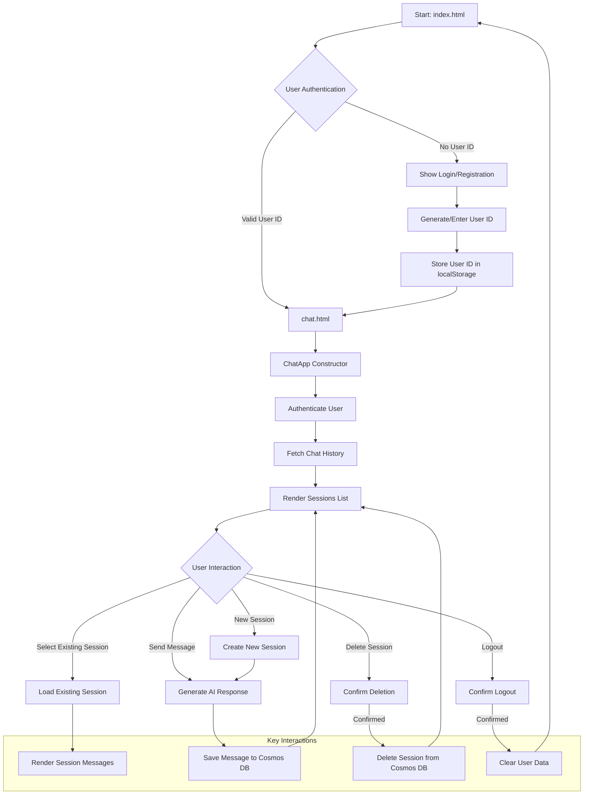

```mermaid
graph TD
    A[Start: index.html] --> B{User Authentication}
    B --> |Valid User ID| C[chat.html]
    B --> |No User ID| D[Show Login/Registration]
    
    D --> E[Generate/Enter User ID]
    E --> F[Store User ID in localStorage]
    F --> C
    
    C --> G[ChatApp Constructor]
    G --> H[Authenticate User]
    H --> I[Fetch Chat History]
    I --> J[Render Sessions List]
    
    J --> K{User Interaction}
    K --> |New Session| L[Create New Session]
    K --> |Select Existing Session| M[Load Existing Session]
    K --> |Send Message| N[Generate AI Response]
    K --> |Delete Session| O[Confirm Deletion]
    K --> |Logout| P[Confirm Logout]
    
    L --> N
    M --> Q[Render Session Messages]
    N --> R[Save Message to Cosmos DB]
    R --> J
    
    O --> |Confirmed| S[Delete Session from Cosmos DB]
    S --> J
    
    P --> |Confirmed| T[Clear User Data]
    T --> A
    
    subgraph Key Interactions
    Q
    R
    S
    T
    end
```
