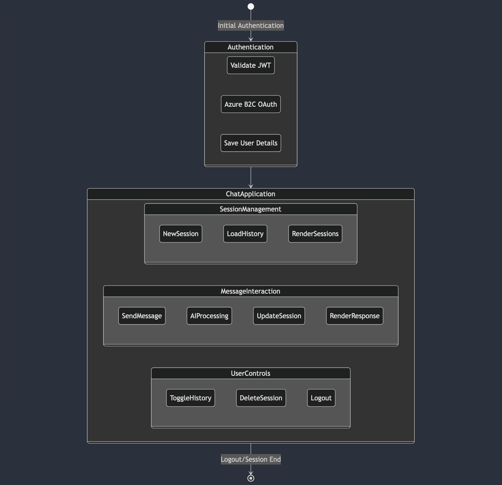
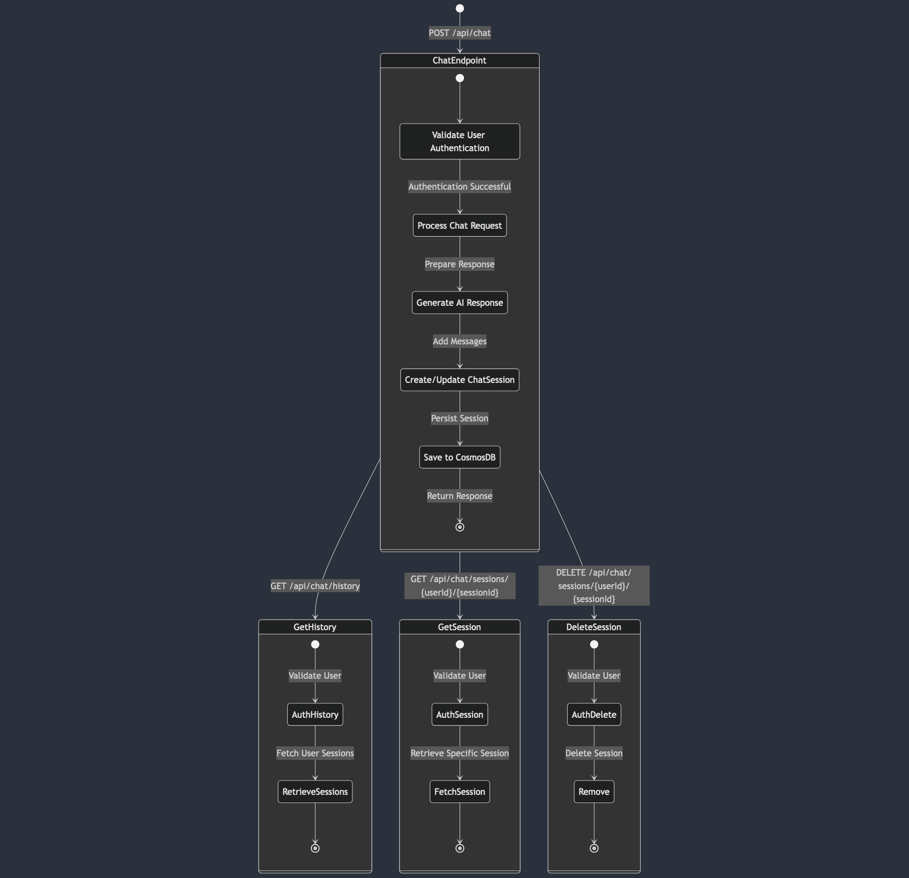

# Numble Chat Application

## Overview
A take on the classic chat application (think of chatgpt), build with .NET 9.0, Azure Cosmos DB, and OpenAI API (via Azure).

## General Architecture Flowcharts

### Frontend Flow

### Backend Flow

## Key Features
- Real-time AI-powered chat sessions
- Persistent chat history
- Session management
- Secure authentication

## Technologies Used
- **Backend**: 
  - .NET 9.0
  - Azure Cosmos DB
  - OpenAI API
- **Frontend**:
  - Vanilla JavaScript
  - HTML5
  - CSS3
- **Authentication**: 
  - Azure AD B2C (using jwt tokens)

## Core Components

### Backend
- **ChatController**: Manages chat-related HTTP endpoints
- **CosmosDbService**: Handles database operations
- **OpenAIService**: Generates AI chat responses
- **AuthenticationMiddleware**: Handles user authentication

### Frontend
- **ChatApp Class**: Manages user interactions
- **Session Management**: Create, load, and delete chat sessions
- **Caching Mechanism**: Local and session storage for performance

## Endpoints

### Chat Endpoints
- `POST /api/chat`: Create or continue chat sessions
- `GET /api/chat/history`: Retrieve user's chat sessions
- `GET /api/chat/sessions/{userId}/{sessionId}`: Get specific session
- `DELETE /api/chat/sessions/{userId}/{sessionId}`: Delete a session

---

**Developed with ❤️ using .NET, Azure, and OpenAI**
